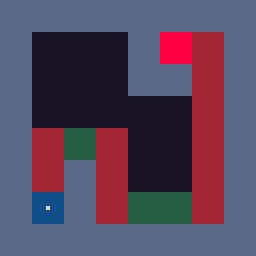
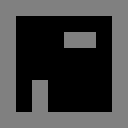
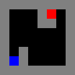
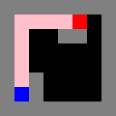
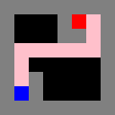
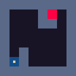
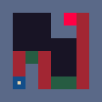

# Hunting behaviour

### Background

The other day I found [this presentation](https://www.youtube.com/watch?v=sVntwsrjNe4&t=346s8) about some of the animation techniques used in the survival platformer game [Rain World](https://en.wikipedia.org/wiki/Rain_World). I really liked a few of the concepts:

- [Procedurally generated animation](https://ksr-ugc.imgix.net/assets/001/529/743/7984c7dfe0ae05dcbc820a6c20d14925_original.gif?ixlib=rb-1.1.0&w=639&fit=max&v=1389817681&auto=format&gif-q=50&q=92&s=b885beac30be769418377538ba9683d1) (as opposed to sprites)
- [Credible creature AI](https://ksr-ugc.imgix.net/assets/017/313/774/0519921b0e69724a97f59647e917bf00_original.gif?ixlib=rb-1.1.0&w=639&fit=max&v=1498766217&auto=format&gif-q=50&q=92&s=fabe3347c62481e86b387e0d0569577c)
- ...

I haven't actually played the game, but after binge watching a few hours of game play, I decided to try to implement some of the concepts myself. The first thing I will try is the hunting behaviour of the lizards.


To keep this article as simple as possible, I will try to use existing libraries whenever possible.

## Our goal

**(will be updated as the tutorial is completed)**



1. ~~Drawing the world~~
2. ~~Basic path finding~~
3. ~~Refactor and animate~~
4. ~~Platformer movement~~
5. ~~Smooth path finding~~
6. 
7. _...some more steps here..._
8. 
9. (optional) Improve the graphics


## 1. Drawing the world

([code for this part](https://github.com/kyeett/tutorials/blob/hb-draw-world/huntingbehaviour/README.md))

First, let's draw our world. We define it using string slices (will be used by the path finding algorithm later).

- `'x'` is a wall
- `' '` is empty space

```go
func main() {
    // Layout of the room
    layout := []string{
        "xxxxxxxx",
        "x      x",
        "x   xx x",
        "x      x",
        "x      x",
        "x x    x",
        "x x    x",
        "xxxxxxxx",
    }
```

Here I use Peter Hellberg's `gfx` package for creating a `NewImage`, `DrawImageRectangle` and finally `SavePNG`.

```go
    height := len(layout)
    width := len(layout[0])
    img := gfx.NewImage(width*tileSize, height*tileSize, color.Transparent)

    // Draw the room
    for y, row := range layout {
        for x, tile := range row {
            c := colornames.Black
            switch tile {
            case 'x':
                c = colornames.Grey
            }

            // Draw the tile
            tileRectangle := image.Rect(0, 0, tileSize, tileSize).Add(image.Pt(x*tileSize, y*tileSize))
            gfx.DrawImageRectangle(img, tileRectangle, c)
        }
    }
    gfx.SavePNG("images/out.png", img)
}
```

Here is the result. Gray is wall (`x`), black is empty space (``).



_Done!_

## 2. Basic path finding

([code for this part](https://github.com/kyeett/tutorials/blob/hb-basic-path-finding/huntingbehaviour/README.md))

Now that we can visualize our world, let's try finding a way from point A to point B in it!

For this, we will use an A\* (a star) algorithm which is popular in game development. Read [this article](http://theory.stanford.edu/~amitp/GameProgramming/AStarComparison.html) for an overview of the algorithm, and [this](https://www.redblobgames.com/pathfinding/a-star/introduction.html) for a more in-depth version with some code. There are [quite a few](https://godoc.org/?q=astar) go implementations of the algorithm. I chose [SolarLune/paths](https://github.com/SolarLune/paths), because I have used some of his packages before.

### SolarLune/paths

Using the package is very straight forward. First we define our grid from the string slice from before, then we can get the path from `start` to `dest` (_we use `false` to turn of diagonal movement_).

```go
func main() {
    // Layout of the room
    layout := []string{
        "xxxxxxxx",
        "x   x  x",
        "x   xx x",
        "x      x",
        "x      x",
        "x x    x",
        "x x    x",
        "xxxxxxxx",
    }
    // Abbrieviated
    ...
    room := paths.NewGridFromStringArrays(layout)
    start, dest := room.Get(1, 6), room.Get(5, 1)
    path := room.GetPath(start, dest, false)

    // Draw path, start and finish
    for _, tile := range path.Cells {
        drawTile(img, tile.X, tile.Y, colornames.Pink)
    }
    drawTile(img, start.X, start.Y, colornames.Blue)
    drawTile(img, dest.X, dest.Y, colornames.Red)
    gfx.SavePNG("images/basic_3.png", img)
}

func drawTile(img *image.NRGBA, x, y int, c color.Color) {
    tileRectangle := image.Rect(0, 0, tileSize, tileSize).Add(image.Pt(x*tileSize, y*tileSize))
    gfx.DrawImageRectangle(img, tileRectangle, c)
}

```

**Result:**

|                                | + path                         |
|--------------------------------|--------------------------------|
|  |  |

- start (blue)
- dest (blue)
- path (pink)

As you can see, it _almost_ works, beside from the fact that we walk through a wall left of the goal. Let's fix that by saying that the cells marked by `x` should not be walkable.

```go
    ...
    // Turn off movement in walls
    for _, cell := range room.GetCellsByRune('x') {
        cell.Walkable = false
    }

    path := room.GetPath(start, dest, false)
    ...
```

Much better! _Done!_

|                                | + path                         |
|--------------------------------|--------------------------------|
|  |  |

## 3. Refactor and animate

([code for this part](https://github.com/kyeett/tutorials/blob/hb-refactor-and-animate/huntingbehaviour/README.md))

Now it is time to do some refactoring. We create a `World` struct that holds the room data and the background image which is static.

**world.go**:

```go
package main

import (
    "image"
    "image/color"

    "github.com/SolarLune/paths"
    "github.com/peterhellberg/gfx"
    "golang.org/x/image/colornames"
)

type World struct {
    background    *image.NRGBA
    room          *paths.Grid
    width, height int
}

func newWorld(layout []string) World {
    height := len(layout)
    width := len(layout[0])
    img := gfx.NewImage(width*tileSize, height*tileSize, color.Transparent)

    // Draw the room
    for y, row := range layout {
        for x, tile := range row {
            c := colornames.Black
            switch tile {
            case 'x':
                c = colornames.Grey
            }

            // Draw the tile
            drawTile(img, x, y, c)
        }
    }

    room := paths.NewGridFromStringArrays(layout)

    // Turn off movement in walls
    for _, cell := range room.GetCellsByRune('x') {
        cell.Walkable = false
    }

    return World{
        background: img,
        room:       room,
        width:      height,
        height:     width,
    }
}

```

Then we create a frame for each frame in the path, using `gfx.Paletted`.

**main.go**

```go
...
    path := w.room.GetPath(start, dest, false)

    animation := gfx.Animation{
        Delay: 10, //
    }

    // Draw frame
    for _, tile := range path.Cells {
        img := gfx.NewPaletted(w.width*tileSize, w.width*tileSize, gfx.PaletteEDG32)

        // Background
        draw.Draw(img, img.Bounds(), w.background, image.ZP, draw.Over)

        // Start and finish
        drawTile(img, start.X, start.Y, colornames.Blue)
        drawTile(img, dest.X, dest.Y, colornames.Red)

        // "creature"
        drawTile(img, tile.X, tile.Y, colornames.Pink)
        animation.AddPalettedImage(img)
    }
    animation.SaveGIF("images/refactor_1.gif")
}
```

**Result**


**Note:** since gifs have is using a palette of colors, instead of all possible RGB, the colors has changed a bit.

### Creature

To prepare for coming steps, we will also create a `Creature` struct that holds a creature's position and path it is moving on. We also convert the path format from grid cells to `gfx.Vec`

**creature.go**

```go
type Creature struct {
    pos  gfx.Vec
    path []gfx.Vec
}
```

**world.go**

```go
func (w *World) findPath(start, dest *paths.Cell) []gfx.Vec {
    path := []gfx.Vec{}
    for _, cell := range w.room.GetPath(start, dest, false).Cells {
        path = append(path, gfx.V(float64(cell.X*tileSize), float64(cell.Y*tileSize)))
    }
    return path
}
```

Now we can draw the creature position, rather then the cell in a path

```go
creatureRect := gfx.R(-2, -2, 2, 2).Moved(stepPosition)
// Move to center of tile
creatureRect = creatureRect.Moved(gfx.V(tileSize/2,
tileSize/2))
gfx.DrawImageRectangle(img, creatureRect.Bounds(), colornames.Pink)
```

**Result**:



_Done!_

## 4. Platformer movement

([code for this part](https://github.com/kyeett/tutorials/blob/hb-platformer-movement/huntingbehaviour/README.md))

Currently, our creature is following a path in the air! To start out with, we want a ground creature, let's make the air not walkable, and add a few ladders.

Here is the new `layout`

```go
layout := []string{
    "xxxxxxxx",
    "x   x-|x",
    "x   xx|x",
    "x     |x",
    "x|-|  |x",
    "x|x|  |x",
    "x|x|--|x",
    "xxxxxxxx",
}
```

- '`x`' is a wall, **_not walkable_**
- '``' is air (previously empty space), **_not walkable_**
- '`|`' is a ladder
- '`-`' is a walkable tile, just to distinguish from '``'

Then we turn of `Walkable` on the air, and update the coloring, and we get a nice, platformer movement

```go
// Turn off movement in walls
for _, cell := range room.GetCellsByRune('x') {
    cell.Walkable = false
}

// Turn off movement in air
for _, cell := range room.GetCellsByRune(' ') {
    cell.Walkable = false
}
```



_Done!_ 

## 5. Smooth path finding

What we did in the previous part is pretty cool, but it doesn't look very natural. In order to we want smooth movement between then tiles, and also smoother transitions in the corners. This can be accomplished using simulated physics and path following.

To do this, we need a few modifications

First, add velocity vector `v` and the index `currentNode` of the point in the path we are going to next

```go
type Creature struct {
    pos, v      gfx.Vec
    path        []gfx.Vec
    currentNode int
}
```

Create a `move()` method for the creature
  
```go

const maxSpeed = 2
const maxAcceleration = 0.5
func (c *Creature) move() {
    steering := c.followPath()

    // Limit acceleration
    if steering.Len() > maxAcceleration {
        steering = steering.Unit().Scaled(maxAcceleration)
    }

    c.v = c.v.Add(steering)

    // Limit velocity
    if c.v.Len() > maxSpeed {
        c.v = c.v.Unit().Scaled(maxSpeed)
    }

    // Move creature with velocity c.v
    c.pos = c.pos.Add(c.v)
}
```

Create a `followPath()` method the creature

```go
// Find the vector to the next target
func (c *Creature) followPath() gfx.Vec {
    target := c.path[c.currentNode]

    // Calculate distance to target node
    distance := target.Sub(c.pos).Len()
    if distance < 20.0 {
        c.currentNode++
    }

    return c.pos.To(target)
}
```

Finally, we tell the loop in **main.go** to run until the end of the path is reached, and call `c.move()` each round

```go
    // Draw frame
    for c.currentNode < len(c.path) {
        c.move()

        ...
        // Creature
        creatureRect := gfx.R(-2, -2, 2, 2).Moved(c.pos)
```

**Result**:


_Starting to look a lot like a hungry lizard, doesn't it?_

### (optional) Resources for path following

I based my code on the examples from this article: [Understanding Steering Behaviors: Path Following](https://gamedevelopment.tutsplus.com/tutorials/understanding-steering-behaviors-path-following--gamedev-8769)

**Craig Reynolds & Boids model**

_The article above is based on the amazing work by Craig Reynolds who came up with the Boids model in 1987! I recommend reading his articles for a deeper understanding_

- [Boids](http://www.red3d.com/cwr/boids/)
- [Steering](http://www.red3d.com/cwr/steer/)

## 6-12 TBD